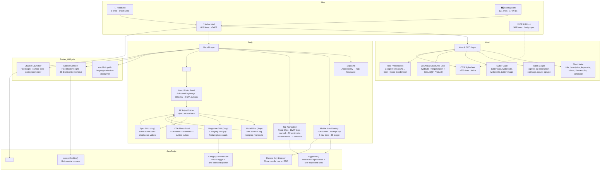

# BMW M — The Ultimate Driving Machine

> **A motorsport-engineering brand interface** — near-black canvas, white BMW Type Next Latin display headlines, full-bleed automotive photography, and the iconic M tricolor stripe.

---

## Features

- **🎯 Full Design System Implementation** — All 20+ components from the DESIGN.md spec faithfully rendered: hero band, top nav, mobile overlay, model cards (3-up), feature cards (3-up), spec cells (4-up), category tabs, CTA band, footer (4-col), cookie consent, chatbot launcher, M stripe dividers, text links, buttons (primary + outline)
- **🌑 Near-Black Canvas** — True `#000` background with white `#fff` type. No light mode exists. Brand voltage comes from photography, not chrome
- **🔷 M Tricolor Branding** — Light blue `#0066b1` → dark blue `#1c69d4` → red `#e22718` used exclusively as 4px stripe dividers, logo accents, and brand-identity markers. Never used as buttons or background fills
- **📸 Full-Bleed Photography** — Edge-to-edge automotive imagery fills entire bands. UI chrome recedes to minimal white labels overlaid on photography. Cars are always the visual subject
- **🔲 Zero Border Radius** — `border-radius: 0` on all buttons, cards, inputs, and containers. Only circular icon buttons use `rounded.full` (9999px). The rectangular silhouette IS the brand
- **🔤 Typography Contrast** — Heavy display headlines (700 weight, UPPERCASE) paired with light body text (300 weight, sentence-case). The weight gap is the editorial signature. Inter + Saira Condensed as open-source substitutes for BMW Type Next Latin
- **🖱️ Hover Effects** — Hero/CTA image zoom (1.04×), card lift (-4px translateY) with image scale (1.06×), spec cell background lighten, nav icon scale, footer select border glow, cookie consent border lighten, mobile close rotate
- **📱 Fully Responsive** — 4 breakpoints: mobile (<768px), tablet (768–1024px), desktop (1024–1440px), wide (>1440px). Grids collapse 3→2→1 columns. Nav collapses to hamburger. Typography scales down (80px→48px hero h1)
- **⚡ Performance Optimized** — LCP-optimized hero with `fetchpriority="high"`, lazy-loaded images (`loading="lazy"`), minimal inline CSS (~5KB), only 2 external HTTP requests (Google Fonts + Unsplash CDN). Zero JavaScript frameworks
- **♿ Accessibility** — Skip navigation link, ARIA roles (`menubar`, `tablist`, `tab`, `dialog`, `button`), ARIA attributes (`aria-label`, `aria-modal`, `aria-expanded`, `aria-selected`), semantic HTML5 landmarks (`<main>`, `<nav>`, `<footer>`, `<article>`), keyboard support (Escape closes mobile nav), descriptive alt texts on all images
- **🔍 SEO Optimized** — Short meta tags (title, description, keywords, robots, author, theme-color), Open Graph (8 properties), Twitter Card (6 tags), JSON-LD structured data (Schema.org `WebSite` + `Organization` + `ItemList` of `Product`), canonical URL, `robots.txt`, `sitemap.xml` (17 URLs)

---

## Dev Stack

| Category | Technology | Details |
|---|---|---|
| **Markup** | HTML5 | Semantic landmarks (`<main>`, `<nav>`, `<article>`, `<section>`), WAI-ARIA roles, schema.org `itemscope`/`itemtype` microdata |
| **Styling** | CSS3 | CSS Grid (3→2→1 column responsive), Flexbox, `aspect-ratio`, `object-fit`, `radial-gradient` (BMW roundel), CSS transitions, media queries |
| **Fonts** | Inter (300/400/700) + Saira Condensed (700) | Google Fonts CDN. Inter is the open-source substitute for licensed BMW Type Next Latin. Saira Condensed for condensed display headlines |
| **JavaScript** | Vanilla ES6 | No frameworks, no libraries. 4 functions: `toggleNav()`, `acceptCookies()`, category tab handler, Escape key listener |
| **Structured Data** | JSON-LD | Schema.org `WebSite`, `Organization` (with `logo` + `sameAs`), `ItemList` of 3× `Product` entities (M3, M4, M5) |
| **Icons** | Native Unicode/Emoji | Language 🌐, Search 🔍, Account 👤, Hamburger ☰, Close ✕ — zero icon library dependency |
| **CDN** | Google Fonts + Unsplash | 2 external origins. All images served via Unsplash CDN with `w=` width parameter for responsive sizing |
| **Deployment** | Static HTML | Zero build step. No package.json. No bundler. No framework. Open directly in browser or serve via any HTTP server |

---

## Project Stats

| Metric | Value |
|---|---|
| **Total files** | 6 |
| **HTML size** | ~34 KB |
| **CSS size** | ~5.5 KB (embedded in `<style>`) |
| **JS size** | ~0.7 KB (embedded in `<script>`) |
| **HTML lines** | 618 |
| **CSS selectors** | 35+ |
| **JavaScript functions** | 4 |
| **Components** | 14 (hero, top nav, mobile nav, model cards ×3, feature cards ×3, spec cells ×4, category tabs ×5, CTA band, footer, cookie consent, chatbot launcher, stripe dividers ×4, text links) |
| **Design colors** | 14 used (from 27 defined in DESIGN.md) |
| **Typography scales** | 11 implemented (from 13 defined) |
| **Spacing tokens** | 8 |
| **Border radii** | 2 used (none + full) |
| **Schema.org entities** | 4 (WebSite, Organization, 3× Product) |
| **Sitemap URLs** | 17 |
| **Responsive breakpoints** | 4 (480px, 768px, 1024px, 1440px) |
| **External HTTP requests** | 2 (Google Fonts CSS + Unsplash images) |
| **Images** | 8 (1 hero `fetchpriority=high`, 7 lazy-loaded) |
| **GitHub** | [girishlade111/BMW-M-design.md](https://github.com/girishlade111/BMW-M-design.md) |

---

## Configuration

### Design Tokens (from [`DESIGN.md`](./DESIGN.md))

#### Color Palette

```yaml
# Brand & Accent
primary:         "#ffffff"    # Primary type and CTA color
m-blue-light:    "#0066b1"    # M tricolor — first stop
m-blue-dark:     "#1c69d4"    # M tricolor — middle stop / BMW heritage blue
m-red:           "#e22718"    # M tricolor — third stop / M power red

# Surface
canvas:          "#000000"    # Default page floor — true black
surface-soft:    "#0d0d0d"    # Spec cells, card-bg sections
surface-card:    "#1a1a1a"    # Feature cards, chatbot launcher
surface-elevated:"#262626"    # Reserved for nested cards

# Text
on-dark:         "#ffffff"    # All headlines and primary text
body:            "#bbbbbb"    # Default running text
body-strong:     "#e6e6e6"    # Emphasized body
muted:           "#7e7e7e"    # Footer links, captions

# Hairlines & Borders
hairline:        "#3c3c3c"    # 1px dividers, card outlines, table rows
hairline-strong: "#262626"    # Stronger borders
```

#### Typography Scale

| Token | Font | Size | Weight | LHeight | LSpace | CSS Use |
|---|---|---|---|---|---|---|
| `display-xl` | Saira Condensed | 80px | 700 | 1.0 | -0.5px | Hero h1 |
| `display-lg` | Saira Condensed | 56px | 700 | 1.05 | -0.5px | Section h2 |
| `display-md` | Saira Condensed | 40px | 700 | 1.1 | -0.5px | Model names, CTA h2 |
| `display-sm` | Saira Condensed | 32px | 700 | 1.15 | -0.5px | Spec values |
| `title-lg` | Inter | 24px | 700 | 1.3 | 0 | Feature card h3 |
| `label-uppercase` | Inter | 14px | 700 | 1.3 | 1.5px | Tabs, buttons, tags, links |
| `body-md` | Inter | 16px | 300 | 1.5 | 0 | Paragraphs, subtitles |
| `body-sm` | Inter | 14px | 300 | 1.5 | 0 | Specs, cookie text |
| `button` | Inter | 14px | 700 | 1.0 | 1.5px | All button labels |
| `nav-link` | Inter | 14px | 400 | 1.4 | 0.5px | Top nav items |
| `caption` | Inter | 12px | 400 | 1.4 | 0.5px | Disclaimer, fine print |

#### Spacing System

Base unit: **4px**. All spacing derives from multiples of 4.

```yaml
xxs: 4px      # Mini gaps
xs:  8px      # Tight spacing
sm:  12px     # Tab padding
md:  16px     # Button gaps, footer bottom
lg:  24px     # Grid gaps, card padding, container padding
xl:  40px     # Section header margin
xxl: 64px     # Hero overlay padding, footer padding
section: 96px # Vertical section padding (major bands)
```

#### Border Radii

```
none: 0px      # All buttons, cards, inputs, containers — the dominant shape
full: 9999px   # Reserved for circular icon buttons only
```

The radius hierarchy is binary: "almost always 0, sometimes circular." Nothing between.

---

## System Architecture



---

## File Structure

```
BMW-M-design.md/
├── DESIGN.md          # Full design system specification
│                     # YAML frontmatter: 27 colors, 13 typography scales,
│                     # 8 spacing tokens, 5 border radii, 21 component specs
│                     # Markdown: brand philosophy, do's/don'ts, responsive
│
├── index.html        # Single-page BMW M website (618 lines)
│                     # All HTML + CSS (<style>) + JS (<script>) in one file
│                     # 14 components · 35+ CSS selectors · 4 JS functions
│
├── CONTEXT.md        # AI Assistant context file (798 lines, ~32KB)
│                     # Complete project explanation for LLM tools
│                     # Architecture, code logic, line numbers, data flow
│
├── robots.txt        # Crawler permissions (8 lines)
│                     # User-agent: * → Allow: /
│                     # Sitemap reference
│
├── sitemap.xml       # XML sitemap (121 lines, 17 URLs)
│                     # Priorities: 1.0 homepage → 0.6 articles
│                     # Changefreq: weekly/monthly
│
└── README.md         # This file — project documentation
```

---

## Instructions

### Local Development

Zero dependencies. Open directly or serve with any static HTTP server:

```bash
# Option 1: Open directly in browser
start index.html                     # Windows
open index.html                      # macOS
xdg-open index.html                  # Linux

# Option 2: Serve locally (recommended for SEO/crawler testing)
npx serve .                          # Node.js (zero config)
python -m http.server 8080           # Python 3
php -S localhost:8080                # PHP
```

### Customization Guide

| What to Change | Where | How |
|---|---|---|
| **Font family** | `index.html:99` + CSS `font-family` | Replace Google Fonts URL with self-hosted BMW Type Next Latin; update all `font-family` declarations |
| **Photography** | `index.html:353, 379, 388, 397, 428, 436, 444, 491` | Replace Unsplash `src` URLs with production BMW M photography |
| **Navigation links** | `index.html:335-339` | Replace `href="#"` with real page URLs |
| **Model specs** | `index.html:383, 392, 401` | Update `itemprop="description"` content with actual specs |
| **Footer links** | `index.html:506-543` | Replace `href="#"` with real URLs |
| **Domain** | `index.html:18,22`, `robots.txt:8`, `sitemap.xml` | Replace `bmwm.example.com` with production domain |
| **JSON-LD URLs** | `index.html:73,81,89` | Update model detail page URLs |
| **Copyright year** | `index.html:548` | Update `© 2026` to current year |
| **Design tokens** | `DESIGN.md:6-27, 29-107` | Change colors, typography, or spacing values; update corresponding CSS in `index.html` |

### SEO Verification

```bash
# Quick SEO health check
grep -c 'meta name="description"' index.html    # Expected: 1
grep -c 'meta property="og:' index.html         # Expected: 8
grep -c 'meta name="twitter:' index.html        # Expected: 6
grep -c 'application/ld+json' index.html        # Expected: 1
grep -c 'itemscope' index.html                  # Expected: 3

# Validate sitemap
xmllint --noout sitemap.xml                     # Expected: exit 0

# Check for broken internal links
grep -c 'href="#"' index.html                   # Count placeholder links to replace
```

### Deployment

Deploy as a **static site** to any host. No build step required.

| Platform | Method | Notes |
|---|---|---|
| **Netlify** | Drag `index.html`, `robots.txt`, `sitemap.xml` into deploy UI | Auto-detects static site |
| **Vercel** | `vercel --prod` from project root | Zero config |
| **GitHub Pages** | Push to `gh-pages` branch; set root to `/` | Free SSL |
| **AWS S3** | `aws s3 sync . s3://bucket-name/ --exclude ".git/*" --exclude "*.md"` | Enable static hosting |
| **Cloudflare Pages** | Connect Git repo; build command: none; output dir: `/` | Free plan |
| **Any HTTP server** | Copy files to `/var/www/html/` or equivalent | nginx, Apache, IIS |

---

## M Tricolor Usage

```
Light Blue (#0066b1) → Dark Blue (#1c69d4) → Red (#e22718)
```

The M tricolor stripe is **exclusively a brand-identity marker**. It appears only as:

| Location | Implementation |
|---|---|
| Logo/wordmark | `.m-stripe-logo` — 3 vertical 4px bars before the BMW roundel |
| Section dividers | `.m-stripe-divider` — 4px-tall full-width horizontal bars between editorial bands |
| Mobile nav top bar | Pinned to top of `.mobile-nav` overlay |
| Hover tab indicator | `category-tab` active state uses white underline, not M stripe |

**Never** use the tricolor for:
- Button fills or backgrounds
- CTA colors or accent surfaces
- Decorative backgrounds or gradients
- Anything that makes it an actionable element

---

## Brand Do's and Don'ts

### ✅ Do
- Anchor every page with full-bleed automotive photography
- Use UPPERCASE display headlines in 700 weight
- Pair heavy display (700) with light body (300)
- Reserve M tricolor for brand-identity moments only
- Use `border-radius: 0` by default — `9999px` only for icon buttons
- Letter-space all-caps labels at 1.5px tracking
- Use 96px vertical spacing between major editorial bands

### ❌ Don't
- Don't introduce brand colors outside the M tricolor
- Don't bold body type — keep at 300 Light
- Don't use rounded buttons — rectangular silhouette is the brand
- Don't put gradient backdrops behind hero type — photography is the depth
- Don't repeat the same surface mode in two consecutive bands
- Don't use the M stripe as a button fill or action surface
- Don't use tracking under 1.5px on button labels

---

## Browser Support

| Browser | Minimum Version | Notes |
|---|---|---|
| Chrome | 88+ | CSS `aspect-ratio` support |
| Firefox | 87+ | Full CSS Grid support |
| Safari | 14.5+ | `aspect-ratio`, Grid, `object-fit` |
| Edge | 88+ | Chromium-based, full support |
| IE11 | ❌ Not supported | No CSS Grid or `aspect-ratio` |

---

## License

Design system © BMW AG. This implementation is a demonstration project based on publicly available brand guidelines. The BMW M wordmark, M tricolor, and BMW roundel are registered trademarks of BMW AG. Not affiliated with or endorsed by BMW AG.
