# BMW M — The Ultimate Driving Machine

> **A motorsport-engineering brand interface** — near-black canvas, white BMW Type Next Latin display headlines, full-bleed automotive photography, and the iconic M tricolor stripe.

---

## Features

- **🎯 Full Design System Implementation** — All 20+ components from the M design spec (hero bands, model cards, spec cells, magazine grid, chatbot launcher, cookie consent, CTA bands, footer)
- **🌑 Near-Black Canvas** — True `#000` background with white type. No light mode. The brand voltage comes from photography, not chrome.
- **🔷 M Tricolor Branding** — Light blue (`#0066b1`) → dark blue (`#1c69d4`) → red (`#e22718`) used as 4px stripe dividers, logo accents, and brand-identity markers only
- **📸 Full-Bleed Photography** — Edge-to-edge automotive imagery as the primary visual carrier. UI chrome recedes to minimal labels.
- **🔲 Zero Border Radius** — `rounded.none` (0px) on all buttons, cards, inputs. Only icon buttons use `rounded.full`. The rectangular silhouette is the brand.
- **🔤 Typography Contrast** — Heavy display (700 weight, UPPERCASE) paired with light body (300 weight). Inter font as BMW Type Next Latin substitute.
- **📱 Fully Responsive** — Mobile (<768px), tablet (768-1024px), desktop (1024-1440px), wide (>1440px). Grids collapse 3→2→1 columns.
- **⚡ Performance Optimized** — LCP-optimized hero with `fetchpriority="high"`, lazy-loaded images, minimal CSS, no external dependencies beyond Google Fonts
- **♿ Accessibility** — ARIA roles, semantic HTML5 landmarks, skip navigation link, keyboard support (Escape closes mobile nav), descriptive alt texts
- **🔍 SEO Optimized** — Full meta tag set (short + long form), Open Graph, Twitter Card, JSON-LD structured data, canonical URL, robots.txt, sitemap.xml

---

## Dev Stack

| Layer | Technology |
|---|---|
| **Markup** | HTML5 (semantic landmarks, `role` attributes, `aria-*`) |
| **Styling** | CSS3 (Grid, Flexbox, Custom Properties fallbacks, Media Queries) |
| **Fonts** | Inter (700/400/300) via Google Fonts — open-source substitute for BMW Type Next Latin |
| **Structured Data** | JSON-LD (Schema.org `WebSite`, `Organization`, `Product`, `ItemList`) |
| **Icons** | Native Unicode/emoji (no icon library dependency) |
| **Deployment** | Static file — zero build step, no framework, no runtime dependencies |

---

## Project Stats

| Metric | Value |
|---|---|
| **Total files** | 4 |
| **HTML size** | ~33 KB |
| **CSS size** | ~5 KB (embedded) |
| **Components** | 12+ (hero, nav, model cards, feature cards, spec cells, tabs, CTA band, footer, cookie consent, chatbot, mobile nav, stripe dividers) |
| **Design tokens** | 28 colors, 13 typography scales, 8 spacing units, 5 border radii |
| **Schema.org entities** | 4 (WebSite, Organization, 3× Product) |
| **Sitemap URLs** | 17 |
| **Responsive breakpoints** | 4 (480px, 768px, 1024px, 1440px) |

---

## Configuration

### Design Tokens (from [`DESIGN.md`](./DESIGN.md))

```yaml
colors:
  canvas: "#000000"
  surface-card: "#1a1a1a"
  surface-soft: "#0d0d0d"
  surface-elevated: "#262626"
  on-dark: "#ffffff"
  body: "#bbbbbb"
  body-strong: "#e6e6e6"
  muted: "#7e7e7e"
  hairline: "#3c3c3c"
  m-blue-light: "#0066b1"
  m-blue-dark: "#1c69d4"
  m-red: "#e22718"
```

### Typography Scale

| Token | Size | Weight | Tracking | Use |
|---|---|---|---|---|
| `display-xl` | 80px | 700 | 0 | Hero h1 |
| `display-lg` | 56px | 700 | 0 | Section heads |
| `display-md` | 40px | 700 | 0 | Model names |
| `display-sm` | 32px | 700 | 0 | Spec values |
| `label-uppercase` | 14px | 700 | 1.5px | Buttons, tabs, labels |
| `body-md` | 16px | 300 | 0 | Paragraphs |
| `nav-link` | 14px | 400 | 0.5px | Navigation |

### Spacing System

Base unit: **4px**. Key tokens: `section` (96px), `xxl` (64px), `xl` (40px), `lg` (24px), `md` (16px), `sm` (12px), `xs` (8px), `xxs` (4px).

### Border Radii

- `none` (0px) — all buttons, cards, inputs, containers
- `full` (9999px) — circular icon buttons, carousel arrows only

---

## System Architecture

```mermaid
flowchart TD
    A["📄 index.html"] --> B["🧱 HTML5 Semantic Structure"]
    A --> C["🎨 CSS3 Design System"]
    A --> D["🧩 SEO & Metadata Layer"]
    A --> E["⚡ JavaScript Behaviors"]

    B --> B1["<main> — Hero, Models, Magazine, Specs, CTA"]
    B --> B2["<nav> — Top navigation + mobile overlay"]
    B --> B3["<footer> — 4-column link grid + legal"]
    B --> B4["<article> — Model cards with itemprop microdata"]
    B --> B5["<section> — Editorial feature cards"]

    C --> C1["Design tokens<br/>(colors, typography, spacing)"]
    C --> C2["Component styles<br/>(hero, buttons, cards, tabs, forms)"]
    C --> C3["Responsive grid system<br/>(3→2→1 column collapse)"]
    C --> C4["M tricolor stripe dividers"]

    D --> D1["Short meta tags<br/>(title, description, keywords, robots)"]
    D --> D2["Long form / Social<br/>(Open Graph, Twitter Card)"]
    D --> D3["📄 JSON-LD structured data<br/>(WebSite, Organization, Product)"]
    D --> D4["🤖 robots.txt — Allow all crawlers"]
    D --> D5["🗺️ sitemap.xml — 17 URLs"]

    E --> E1["Mobile nav toggle + Escape key"]
    E --> E2["Cookie consent dismissal"]
    E --> E3["Category tab switching + aria-selected"]

    F["🖼️ Unsplash CDN<br/>(automotive photography)"] --> B1

    G["🔤 Google Fonts CDN<br/>(Inter 300/400/700)"] --> C1
```



---

## File Structure

```
BMW-M-design.md/
├── DESIGN.md          # Full design system specification (YAML tokens, components, guidelines)
├── index.html         # Single-page BMW M brand website (all HTML + CSS + JS)
├── robots.txt         # Crawler permissions — allows all agents
├── sitemap.xml        # XML sitemap — 17 URLs with priorities & changefreqs
└── README.md          # This file
```

---

## Instructions

### Local Development

This is a **zero-dependency static site**. No build tools, no package managers, no install step.

```bash
# 1. Clone or cd into the project
cd BMW-M-design.md

# 2. Open in browser
open index.html          # macOS
start index.html         # Windows
xdg-open index.html      # Linux

# Or serve locally with any HTTP server (recommended for SEO testing)
npx serve .              # Node.js
python -m http.server    # Python 3
```

### Customization

- **Font**: Replace `Inter` in the Google Fonts URL and CSS `font-family` with a licensed BMW Type Next Latin font file
- **Photography**: Update `src` attributes on `` tags with actual BMW M photography (replace Unsplash placeholders)
- **Links**: Replace `href="#"` values with real page URLs once routes are built
- **Domain**: Update `https://bmwm.example.com/` in `canonical`, `og:url`, `robots.txt`, and `sitemap.xml` with the production domain

### SEO Verification

```bash
# Check page for SEO meta tags
grep -c 'meta name="description"' index.html    # → 1
grep -c 'meta property="og:' index.html         # → 8+
grep -c 'meta name="twitter:' index.html        # → 6+
grep -c 'application/ld+json' index.html        # → 1

# Validate sitemap
xmllint --noout sitemap.xml                     # Must exit 0
```

### Deployment

Deploy as a **static site** to any host:

| Platform | Method |
|---|---|
| Netlify | Drag `index.html` + `robots.txt` + `sitemap.xml` into deploy UI |
| Vercel | `vercel --prod` from project root |
| AWS S3 | `aws s3 sync . s3://bucket-name/ --exclude ".git/*" --exclude "*.md"` |
| GitHub Pages | Push to `gh-pages` branch; set root to `/` |

---

## M Tricolor Usage

```
Light Blue → Dark Blue → Red
  #0066b1     #1c69d4     #e22718
```

The tricolor is **exclusively a brand-identity marker** — used on:
- Logo / wordmark accents
- 4px horizontal section dividers
- Motorsport chrome callouts
- Mobile nav top bar

It is **never** used as a button fill, background surface, or CTA color.

---

## License

Design system © BMW AG. This implementation is a demonstration project based on publicly available brand guidelines. The BMW M wordmark and M tricolor are registered trademarks of BMW AG.
